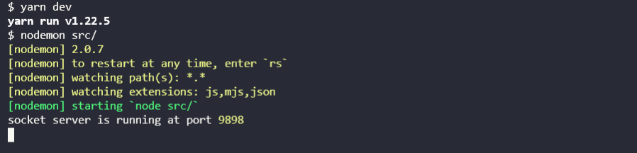
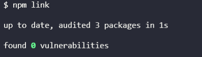
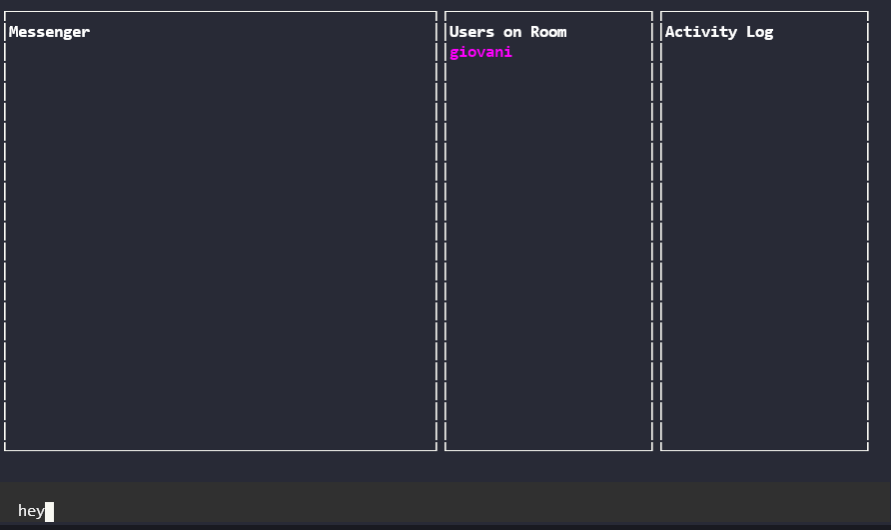
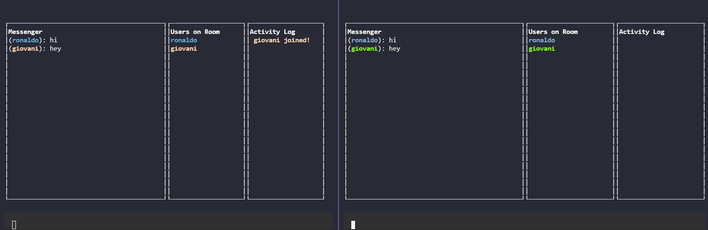
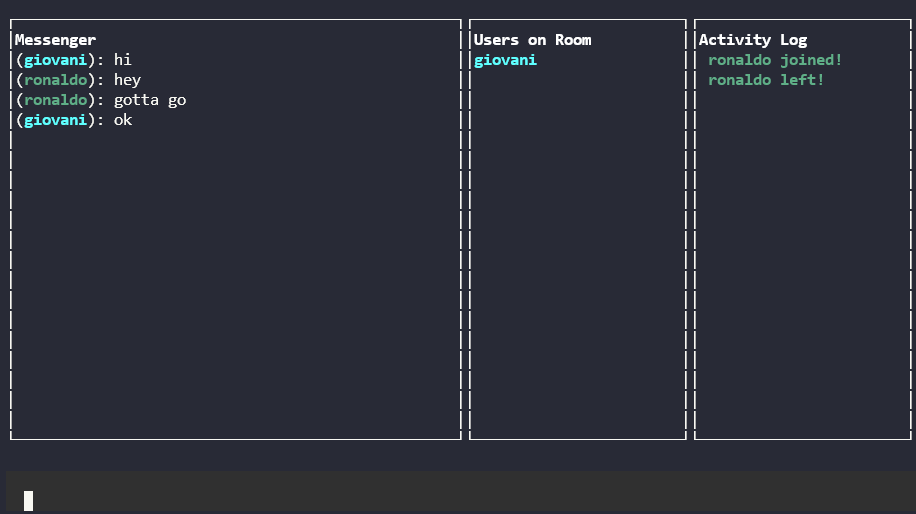
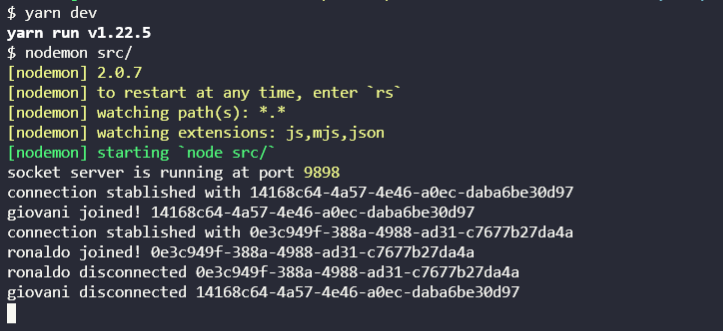

# Commandline-chat v1.0
 Commandline-chat is a Javascript project created during the JS Expert event taught by Erick Wendel.
 
## Getting Started

<br>

### 1. Run the server in server/:

```bash
npm run dev
# or
yarn dev
```


### 2. In the client/ run:
```bash
npm link
# This will add the global command (cmdchat) to your pc.

# To remove, run:
npm unlink -g @rgiovani/commandline-chat-client
```


<br>

### 3. Now, at any command prompt, you can type:

<br>


<br>

```bash
 cmdchat --username namehere --room roomhere

  cmdchat --username namehere --room roomhere --hostUri https://myserver.com/
```

- ##### *--username:* name that appears to everyone in the chat. 

- ##### *--room:* room name to enter, if the room name does not exist, a new one will be created with the name you enter.

- ##### *--hostUri:* http://localhost:9898/ by default, or you can place the link where the server was deployed.

<br>

#### 1. **When executing the command, a chat will appear and you will be able to chat with anyone who enters.**


<br>
<br>

#### 2. **'Messenger' shows messages in real time. 'Users in the room' shows the users present in the same room. 'Activity log' shows when someone enters and leaves the room.**


<br>
<br>

#### 3. **As here, an example of how the activity log works:**


<br>
<br>

### 4. **While the server is running, it will show all the activities that happen in real time, it will log everything.**


<br>


